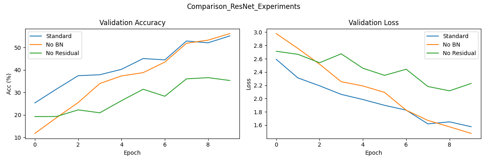
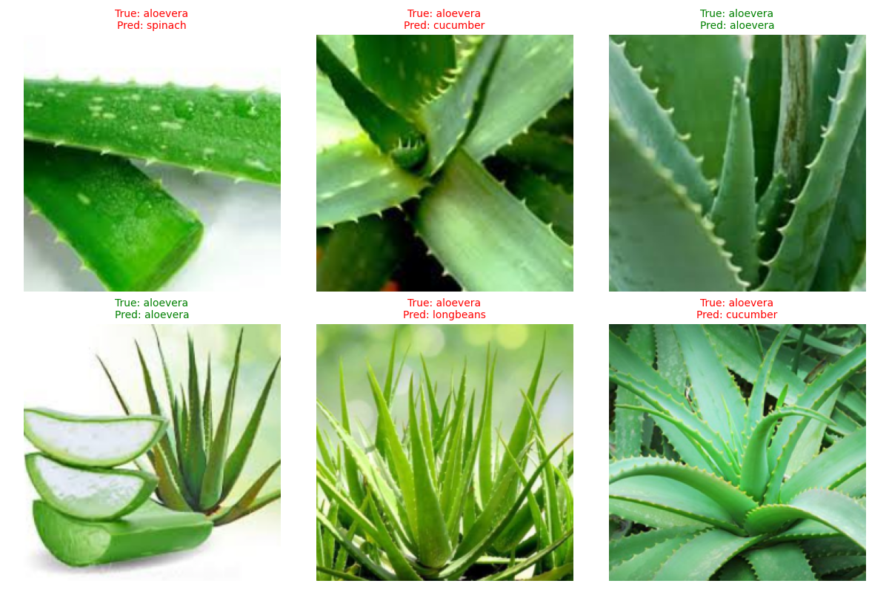
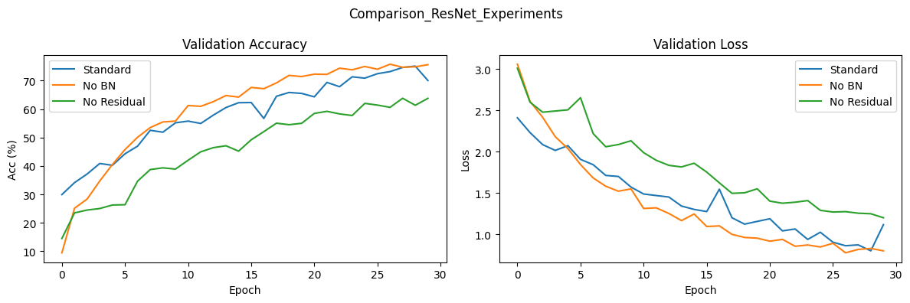
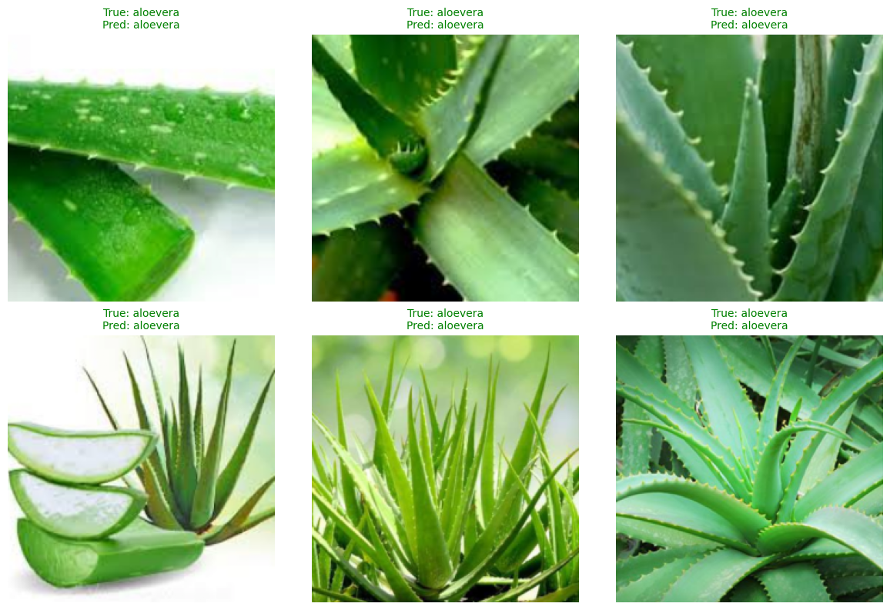

<h1>学习报告6</h1>

| 姓名：|林鑫| 学号：| 2405030219 | 日期：| 2026. 6.5|
| :--- | :--- | :--- | :--- | :--- | :--- |

**学习内容：** 第四阶段的ResNet项目（图片分类）

---
### 概要：
数据来源：ModelScope
对30种植物/水果进行图像分类（ResNet18）
---
### 实验分组
1. 标准组：完整ResNet（带BN+残差）
2. 去BN组：保留残差、删掉所有BN层
3. 去残差组：保留BN、去掉残差短路连接

### 实验结果
#### 损失和精度结果（横轴有误，epoch为1~10）

标准模型：准确率涨得稳且初始较高、损失稳步下降，整体效果最好；

去掉BN：开局效果很差，前期收敛慢，最后精度略低于标准模型；

去掉残差：准确率忽高忽低，最终准确率是三组里最低的，模型很难学好。

芦荟被错认为黄瓜等，可能是外观颜色的因素

Q：为什么残差链接对这个实验的影响要大于批量归一化呢？
A：残差链接解决的是底层结构缺陷，没有残差，网咯加深会出现梯度消失等问题，锁死了模型的上限；BN只是优化训练速度，去掉只会前期收敛变慢，但随着轮次上升会慢慢追上。

### 为观察轮次对精度的影响，提高轮次再次训练（30次）
#### 二次实验结果

结果表明，精度确实显著提高