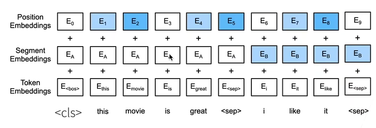

<h1>学习报告6</h1>

| 姓名：|林鑫| 学号：| 2405030219 | 日期：| 2026.5.24 |
| :--- | :--- | :--- | :--- | :--- | :--- |

**学习内容：** bert

---
### 概要：
学习bert的基础知识

---

### BERT的理论内容
动机：想把图片分类那一块比较成熟的“预训练+微调”那一套范式迁移到NLP邻域。

架构：只有解码器的transformer

#### 对输入的修改
1.token embeddings，每个样本都是一个句子对；
$<cls>为开头，<seq>为分隔符$，一这种句子对的形式学习语言关系。
2.segment embeddings，定义哪个词是属于那个句子的；
3.position embeddings，相比于transformer的固定的位置编码，Bert的位置编码换成可训练的形式；比固定的值更加灵活，模型可以学习到各种语言习惯（报道，聊天，文言文等）。

#### 预训练任务1：带掩码的语言模型（完形填空）
Bert使用transformer的解码器是双向（看前后的词）的，但是传统的语言模型是单向的（往后看），即根据前面的词预测后面的词。
所以为了适配任务，设计了掩码：每次随机对某些词换成$<mask>$,达到类似与完形填空的效果。
但mask只在训练过程中设置，微调任务里的文本没有mask，所以模型做多了mask遇到没有mask会不适应。
所以做了3种处理：大部分（80%）做完形填空，小部分（10%）做随机词，小部分（10%）保持原来的词。
#### 预训练任务二：下一个句子预测
即预测两个句子是不是相邻的。
一半样本为相邻的，另一半不相邻的样本来训练，
再将每个cls的输出做一个全连接来预测。