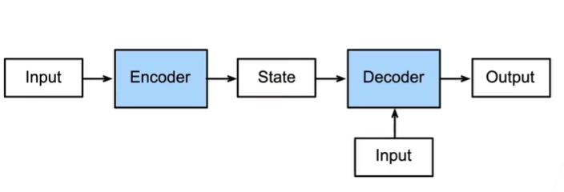
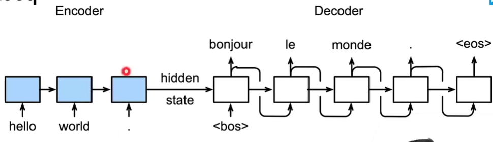
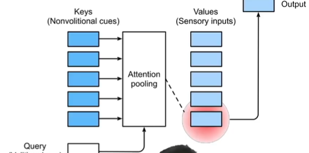
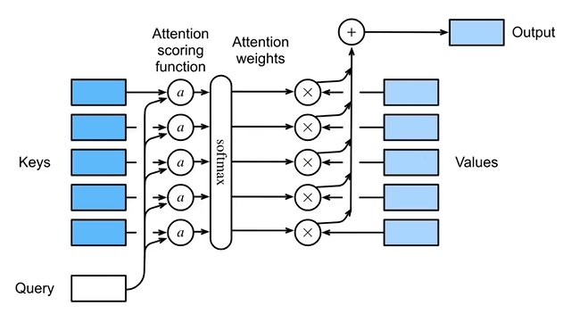
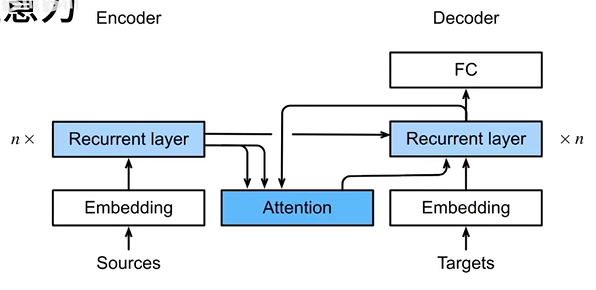
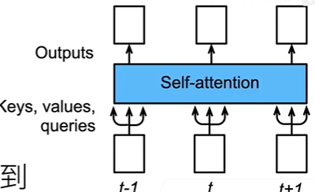
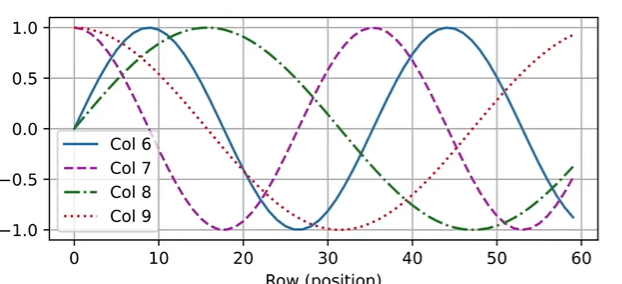
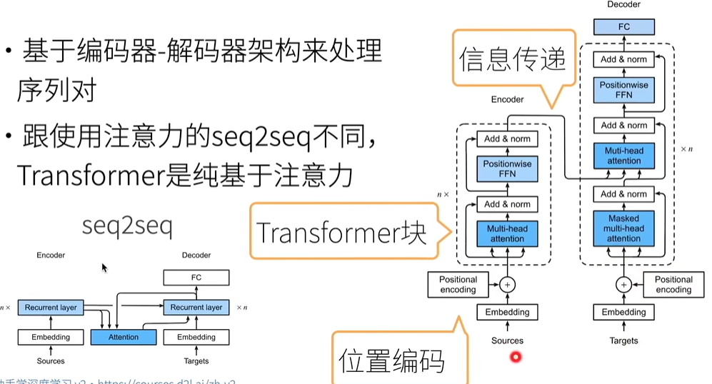
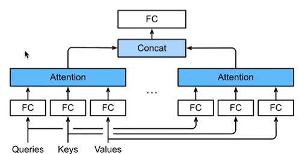
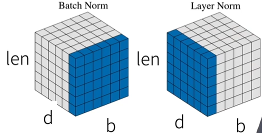

# 学习报告5

| 姓名 | 林鑫 | 学号 | 2405030219 | 日期 | 2026.5.17 |
| :--- | :--- | :--- | :--- | :--- | :--- |

**学习内容：** 编码器-解码器、注意力机制、seq2seq、自注意力机制、transformer等

---

### 概要：
编码器-解码器、seq2seq、自注意力机制、transformer等内容的基础知识

---
### 编码器-解码器
从CNN看：编码器是将输入编程成一个中间表达形式（特征）；解码器主要就是把这种表达形式（特征）解码成一个具体的标签（分类）；
从RNN看：编码是将文本转换成向量表示并输出最后的隐状态，最后解码（全连接）输出；

#### 编码器-解码器架构
编码器Encoder处理输入，转为中间状态（state），解码器Decoder处理输出；

### seq2seq
即一个句子到另一个句子，可以用来做机器翻译
编码器为一个RNN，用于读取句子，压缩信息到state，Encoder可以双向（看前后的信息）而Decoder不行；解码器也是用RNN来输出，输入和输出的长度可以不同；
细节：编码器没有输出的RNN，所以编码器最后的隐状态作为解码的初始隐状态
训练方式：训练时解码使用真正的词做输入，但容易过拟合；推理的输入是上一步的输出，容易错。

#### 衡量生成序列好坏的BLEU
n-gram：句子中连续n个词；$p_n$是n-gram的匹配度（精度）。
例子：ABCDEF到ABBCD，$p_1=4/5,P_2=3/4,p_3=1/3,p_4=0$

BLEU定义：

$\text{BLEU} = \exp\left( \min\left(0, 1 - \frac{\text{len}_\text{label}}{\text{len}_\text{pred}}\right) \times \prod_{n=1}^{k} p_n^{1/2^n} \right)$
惩罚项：
$\min\left(0, 1 - \frac{\text{len}_\text{label}}{\text{len}_\text{pred}}\right)$

如果预测输出长度小于标签长度，该项将为负数，会拉低BLEU分数，否则作为0

长匹配由高权重：
$\prod_{n=1}^{k} p_n^{1/2^n}$
n越长，${1/2^n}$越小，整个项反而更大

### 注意力机制
随意线索：不刻意而联想到的线索，被动的
不随意线索：想要做某事主动寻找的线索（卷积、全连接，池化层）

注意力机制则显示考虑随意线索并进行建模：
随意线索称为查询query，每一个输入则量化为K-v的键值对
注意力池化会根据query有偏向的选某些输入

#### 非参注意力池化层

给定数据 $(x_i, y_i),\ i = 1, \dots, n$，即k-v

平均池化是最简单的方案：
  $f(x) = \frac{1}{n} \sum_{i} y_i$

更好的方案是Nadaraya-Watson核回归：
  $$
  f(x) = \sum_{i=1}^{n} \frac{K(x - x_i)}{\sum_{j=1}^{n} K(x - x_j)} y_i
  $$
  `query`：$x$，`key`：$x_i$，`value`：$y_i$
  K用以衡量$x与x_i$的相似度，离得越近K值越大，权重越大，反之越小。

  #### Nadaraya-Watson 核回归
使用高斯核：
$$
K(u) = \frac{1}{\sqrt{2\pi}} \exp\left(-\frac{u^2}{2}\right)
$$

代入后得到：
$$
\begin{aligned}
f(x) &= \sum_{i=1}^{n} \frac{\exp\left(-\frac{1}{2}(x - x_i)^2\right)}{\sum_{j=1}^{n} \exp\left(-\frac{1}{2}(x - x_j)^2\right)} y_i \\
&= \sum_{i=1}^{n} \mathrm{softmax}\left(-\frac{1}{2}(x - x_i)^2\right) y_i
\end{aligned}
$$

#### 参数化的注意力机制
在 Nadaraya-Watson 核回归基础上，引入可学习的参数 \( w \)：

$$
f(x) = \sum_{i=1}^{n} \mathrm{softmax}\left(-\frac{1}{2}\left((x - x_i) w\right)^2\right) y_i
$$
好处：可以学习并加入到深度学习框架，能适配各种分布的数据，解决更复杂的问题

### 注意力分数
之前的公式
$$
f(x) = \sum_{i=1}^n \alpha(x,x_i)y_i = \sum_{i=1}^n \text{softmax}\left(-\frac{1}{2}(x-x_i)^2\right)y_i
$$
注意力分数即query和key之间的原始相似度；
注意力机制先将每个key和query之间的分数算出来，再做一个softmax算出每个key的权重，最后加权输出

#### 拓展到高纬度
即拓展到向量形式，$q，k，v都可以是向量，且长度可以不一样$；
公式和原来一样：
$$
\alpha(q, k_i) = \text{softmax}\big(a(q, k_i)\big) = \frac{\exp\big(a(q, k_i)\big)}{\sum_{j=1}^m \exp\big(a(q, k_j)\big)} \in \mathbb{R}
$$
由于维度不同，所以注意力分数也要有新的计算方式

#### 加性注意力
可学习参数定义：
- W_k \in \mathbb{R}^{h \times k}：Key 的投影矩阵，把 k 维的 Key 投影到 h 维空间
- W_q \in \mathbb{R}^{h \times q}：Query 的投影矩阵，把 q 维的 Query 投影到同一个 h 维空间
- v \in \mathbb{R}^{h}：最终的输出向量，把 h 维的隐藏表示压缩成 1 维的注意力分数

计算公式：
$$
a(k, q) = v^T \tanh(W_k k + W_q q)
$$
相当于一个单层MLP

#### 缩放点积注意力
当query和key是相同维度的向量，则可以利用点积计算：
$$
a(q, k_i) = \frac{\langle q, k_i \rangle}{\sqrt{d}} = \frac{q^\top k_i}{\sqrt{d}}
$$
根据内积原理，值越大相似度越高

为什么这么设计而不直接使用加性注意力：
加性注意力参数过多，在处理大模型和长文本会有算力负担，训练速度慢。

### 注意力机制的seq2seq
动机：在seq2seq机器翻译中，每一个词的输出都源于Encoder最后一个词输出的隐藏状态，里面所包含的信息过多，没法对应(输出的第一个词应该对应原句子的第一个词)，这时候就需要加入注意力机制来提取重要的那一部分。

原seq2seq的Encoder只对最后一个词做输出，加入注意力机制则对每一个词都做k-v的输出；
而Decoder对上一个词预测的输出的隐藏状态作为query；最后注意力机制和下一个新输入的词向量合并进入下一个单元。

### 自注意力机制
给定序列$x_1,...,x_n，任意x_i长度为d$
公式：
$$
y_i = f(x_i, (x_1,x_1), ..., (x_n,x_n)) \in \mathbb{R}^d
$$
自注意力机制将$x_i$当作query，把所以的$x_1,...,x_n$当作k，v；对每一对$x_j,j=1,...,n$算注意力分数，再算注意力权重之后加权得到$y_i$，每一个$y_i$都是包含对$x_i$的上下文关系的信息（相当于做了特征提取）。

### 位置编码
和RNN不同，自注意力并行计算没有记录位置信息，不能处理好序列内容；这里引入位置编码矩阵$假设长度为n的序列是\boldsymbol{X} \in \mathbb{R}^{n \times d}，那么使用位置编码矩阵\boldsymbol{P} \in \mathbb{R}^{n \times d}来输出\boldsymbol{X} + \boldsymbol{P}作为自编码输入$；
从输入入手，将包含位置信息的P加入到输入，也保证了并行计算；
详细的计算公式：
$$
p_{i,2j} = \sin\left(\frac{i}{10000^{2j/d}}\right), \quad p_{i,2j+1} = \cos\left(\frac{i}{10000^{2j/d}}\right)
$$
对维度偶数列用sin计算，奇数用cos计算，得到一个关于位置的向量（如图：每个位置都能4条曲线4个值，每个位置的值都不一样），距离越远差距越大

问题：不会出现重复的一组数吗？确实会有重复，但维数也越多概率越小，日常的短序列文本一般遇不见

#### 相对位置信息
通过数学公式推导，位置  i+δ  的编码，可以通过一个和  i  无关的固定矩阵，直接由位置  i  的编码旋转得到：
$$
\begin{bmatrix}
\cos(\delta\omega_j) & \sin(\delta\omega_j) \\
-\sin(\delta\omega_j) & \cos(\delta\omega_j)
\end{bmatrix}
\begin{bmatrix}
p_{i,2j} \\
p_{i,2j+1}
\end{bmatrix}
=
\begin{bmatrix}
p_{i+\delta,2j} \\
p_{i+\delta,2j+1}
\end{bmatrix}
$$
### transformer
#### transformer架构
基于seq2seq改进，但没有循环网络，纯基于注意力和一些网络组成的transformer块。

#### 多头注意力（multi-head attention）
流程：对同一对key，value，query做全连接，映射到h个不同的子空间（头），对每个头算注意力池化，再concat（所有维度加起来），再做一个全连接得到输出。
目的：可以抽取到不同的信息，例如短距离关系和长距离关系。

问题：输入为什么要做全连接而不是把原输入直接个每个头？
答：如果不做全连接，每个头都是一样输入，那就相当于没分头，输出都是一样的东西；每个头都有独立的全连接，这样可以提取不同的信息。

需要学的参数：
定义输入向量：$q \in \mathbb{R}^{d_q}，k \in \mathbb{R}^{d_k}，v \in \mathbb{R}^{d_v}$

第 $i$ 个头的可学习参数：
  - $W_i^{(q)} \in \mathbb{R}^{p_q \times d_q}$
  - $W_i^{(k)} \in \mathbb{R}^{p_k \times d_k}$
  - $W_i^{(v)} \in \mathbb{R}^{p_v \times d_v}$

第 $i$ 个头的输出：
  $h_i = f\left(W_i^{(q)} q,\ W_i^{(k)} k,\ W_i^{(v)} v\right) \in \mathbb{R}^{p_v}$

输出层可学习参数：
  $W_o \in \mathbb{R}^{p_o \times h p_v}$

多头注意力的最终输出：
  $$
  W_o \begin{bmatrix} h_1 \\ \vdots \\ h_h \end{bmatrix} \in \mathbb{R}^{p_o}
  $$

有掩码的多头注意力：再解码那一部分的多头注意力
解码器在对序列中一个元素输出的时候，只能看前面的元素，不能偷看后面的元素，所以用掩码。

#### 基于位置的前馈网络（positionwise FFN）
1. 「将输入形状由  (b, n, d)  变换成  (bn, d) 」，为方便后续运算；
2. 「作用两个全连接层」，先提升维度在压缩，目的是靠多层线性运算搭配激活函数，丰富词的信息量；
3. 「输出形状由  (bn, d)  变化回  (b, n, d) 」，最后还原格式，用于衔接其他网络。

#### 层归一化Add&norm
transformer做了归一化和残差链接两个优化方法，但这里不能做批量归一化，批量归一化是对每个通道/特征做归一化，但再NLP里面序列长度会变，随意她算的均值方差也会不稳定.

对于数据（批量大小b，序列长度len，特征维度d）
batchnorm处理（b，len），layer做（len，d），虽然len对于多个批量会变，但layer只处理一个b（一句话），所以相当于没变。

#### 信息传递
编码到解码的过程；
将编码器的输出yi作为解码中第i个transformer块中的多头注意力里的k-v，而query来自目标序列；

